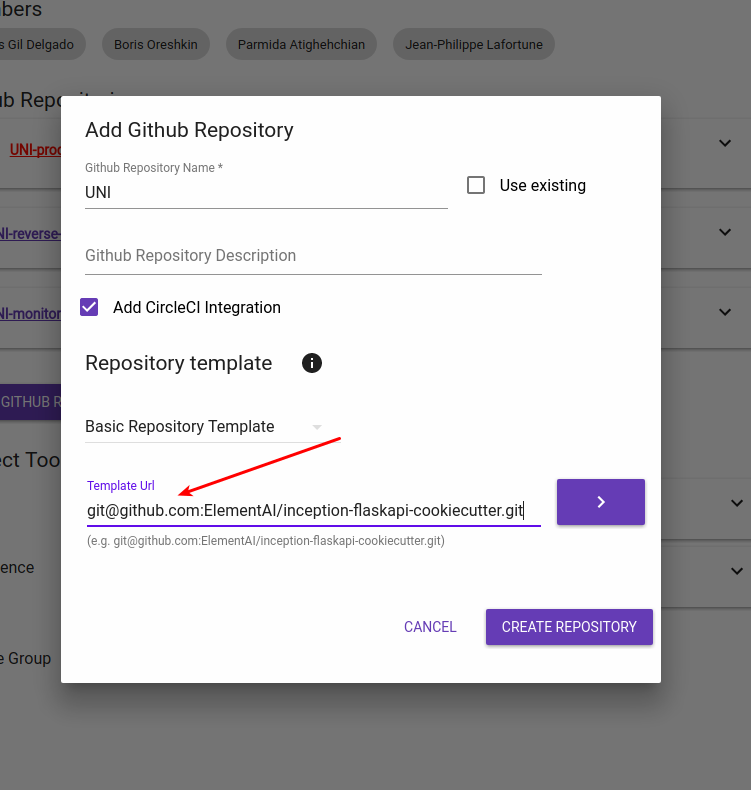

# Cookiecutter: Better Project Templates


Cookiecutter creates projects (python, notebook, js, C++, ...) from project templates in jinja2.


## Install

```sh
pip install cookiecutter
```

## Use

* Remote repo:
    ```sh
    cookiecutter https://github.com/ElementAI/inception-flaskapi-cookiecutter
    # or shortcut
    cookiecutter (gh|bb|gt):ElementAI/inception-flaskapi-cookiecutter
    ```

* Local template:
    ```sh
    cookiecutter inception-flaskapi-Cookiecutter
    ```

* Inception:
    

## Project structure

```
cookiecutter-project-name/
├── cookiecutter.json
├── {{ cookiecutter.project_name }}         project_name
│   ├── {{ cookiecutter.project_name }}     ├──project_name
│   │   └── other_file.txt                  │  └── other_file.txt
│   ├── {{ cookiecutter.project_name }}.py  ├──project_name.py
│   └── settings.py                         └── settings.py
├── hooks
│   ├── post_gen_project.py
│   └── pre_gen_project.py
└── README.md
```
Where `cookiecutter.json` are template variables.

```json
{
    "full_name": "pgranger",
    "email": "pgranger@elementai.com",
    "project_name": "project_name",
    "project_slug": "{{ cookiecutter.project_name|lower|replace(' ', '-') }}",
    "repo_name": "repos-name",
    "project_short_description": "Shrot description",
    "year": "2017",
    "version": "0.1",
    "licence": ["MIT", "BSD-3", "GNU GPL v3.0", "Apache Software License 2.0"],
    "use_docker": "y"
}
```

## Lot of [existing templates](https://cookiecutter.readthedocs.io/en/latest/readme.html#a-pantry-full-of-cookiecutters)

## Variables in files

```python
# hello.py
print("Hello, {{cookiecutter.full_name}}") # will be replace by print("Hello, pgranger")
```

## Hooks

* Validate variables in `pre_gen`

    ```python
    # hooks/pre_gen_project.py
    version = float('{{ cookiecutter.version }}')

    if version > 1.0:
      print("You can not start with version higher that 1.0")
      # exits with status 1 to indicate failure
      sys.exit(1)
    ```

* Delete files in `post_gen`

    ```pyhton
    # hooks/post_gen_project.py
    if '{{ cookiecutter.use_docker }}'.lower() != 'y':
      for filename in ['docker-compose.yml', 'Dockerfile']:
        os.remove(PROJECT_DIRECTORY, filename)
    ```

## Good to know

* Copy whithout render, if lot of tags in your files.
    ```json
    {
      "project_slug": "sample",
      "_copy_without_render": [
          "*.html",
          "*not_rendered_dir",
          "rendered_dir/not_rendered_file.ini"
      ]
    }
    ```

* Escape tags that look like jinja2 in your templates, [see jinja2](http://jinja.pocoo.org/docs/templates/#escaping)
    ```html
    
    <p>Go <a href="{{ url_for('home') }}">Home</a></p>
    
    <!-- OR -->
    {{ {{ url_for('home') }} }}
    ```

## Extra

Re-run cookiecutter on an existing versionned project to upgrade to latest template.

```bash
cookiecutter cookiecutter-presentation/
# commit projet and change template
cookiecutter --replay -f cookiecutter-presentation/
# git st
cookiecutter -f cookiecutter-presentation/ # no docker
```
